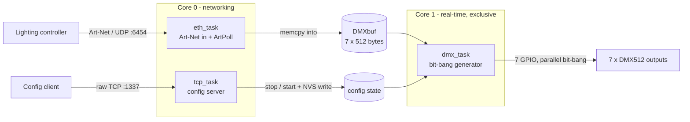

# ESP32 ArtNetNode

Firmware that turns an ESP32 Ethernet board into an Art-Net → DMX512 node.
Receives Art-Net DMX over wired Ethernet, generates seven DMX512 outputs by
software bit-banging, exposes a raw-TCP command interface for configuration, and
answers ArtPoll discovery.

Reliability and deterministic timing are primary requirements (live lighting).
Interfaces ESP-IDF directly, no external libraries.

- **Art-Net in:** UDP, port `6454`, wired Ethernet (RMII + LAN87xx PHY)
- **DMX out:** 7 × DMX512, software bit-bang at 250 kbaud
- **Config:** raw TCP line protocol, port `1337`
- **Discovery:** responds to ArtPoll with ArtPollReply
- **Persistence:** configuration stored in NVS
- **Targets:** Olimex ESP32-POE (deployed) and WT32-ETH01 (secondary), `rack`/`mini` variants

---

## Table of contents

- [Architecture](#architecture)
- [Supported hardware](#supported-hardware)
- [DMX512 bit-bang engine](#dmx512-bit-bang-engine)
- [Art-Net & network](#art-net--network)
- [TCP configuration interface](#tcp-configuration-interface)
- [Persistence (NVS)](#persistence-nvs)
- [Building, flashing, monitoring](#building-flashing-monitoring)
- [Required sdkconfig settings](#required-sdkconfig-settings)
- [Pin reference](#pin-reference)
- [Repository layout](#repository-layout)
- [Known limitations](#known-limitations)

---

## Architecture

Three tasks across the ESP32's two cores. Core 1 is dedicated to DMX generation;
the two network tasks run on core 0 so they cannot disturb DMX timing.



| Task | Core | Priority | Role |
|---|---|---|---|
| `dmx_task` | 1 | `configMAX_PRIORITIES-1` | Bit-bangs DMX inside a critical section; owns core 1 |
| `eth_task` | 0 | idle + 2 | Receives Art-Net UDP (port `6454`), writes `DMXbuf`, answers ArtPoll |
| `tcp_task` | 0 | idle (raised while a client is connected) | Config server (port `1337`) |

Cross-task coordination uses a stop/start handshake, not locks. To change shared
state (patch table, sync settings, channel count), `tcp_task` calls `stopDMX()`,
which sets `stopFlag` and waits for `dmx_task` to acknowledge (`dmxStopped`) that
it has left the critical section. NVS is written and buffers mutated only after
that; `startDMX()` resumes the generator. `eth_task` also pauses while `stopFlag`
is set. DMX output is never reconfigured mid-frame.

---

## Supported hardware

Both boards are an ESP32 + a LAN87xx PHY over RMII, so they share the
`esp_eth_phy_new_lan87xx()` driver and the fixed RMII data pins. They differ in
PHY address, PHY-power GPIO, and RMII clock direction, which changes which GPIOs
are free for DMX output.

Board and device variant are selected at compile time via `-D` flags in
[platformio.ini](platformio.ini); `src/main.c` `#ifdef`s on them.

| Parameter | Olimex ESP32-POE (deployed) | WT32-ETH01 (secondary) |
|---|---|---|
| PlatformIO `board` | `esp32-poe` | `wt32-eth01` |
| PHY chip / driver | LAN8710A / `lan87xx` | LAN8720 / `lan87xx` |
| PHY address | `0` | `1` |
| PHY power GPIO | `12` | `16` |
| MDC / MDIO | `23` / `18` | `23` / `18` |
| RMII REF_CLK | OUT on GPIO17 (internal APLL) | IN on GPIO0 (external 50 MHz osc) |
| Free for DMX | GPIO17 taken by clock | GPIO16 taken by power, GPIO0 by clock |

> A naive LAN8720/ESP32 default matches Olimex, not WT32. The common default
> outputs the clock on GPIO17 with PHY address 0 (Olimex). WT32-ETH01 uses an
> external clock in on GPIO0 with PHY address 1. The firmware sets the clock
> mode/GPIO in code per board, so it does not depend on any default.

> WT32-ETH01 DMX pin maps are placeholders. No WT32 device has been built. Its
> `GPIO_patch[]` entries (`16→17`, `0→12`) are untested. The Olimex maps are
> proven on hardware.

---

## DMX512 bit-bang engine

`dmx_task` ([src/main.c:186](src/main.c#L186)) generates DMX. There is no UART or
RMT peripheral; all timing is done by counting CPU cycles, and all seven outputs
are driven in parallel.

- Runs alone on core 1 at max priority inside `vPortEnterCritical()`. Interrupts
  and the scheduler are held off so timing is deterministic.
- All 7 outputs driven in parallel, bit by bit. For each DMX bit-time it builds a
  bitmask and writes every output at once via the GPIO set/clear registers
  `GPIO_OUT_W1TS_REG` (`0x3ff44008`) and `GPIO_OUT_W1TC_REG` (`0x3ff4400c`).
  These registers only cover GPIO0..31, so every DMX pin must be ≤ 31.
- Cycle-counted timing: busy-waits 960 CPU cycles per bit using
  `xthal_get_ccount()`. 960 cycles ÷ 240 MHz = 4 µs = 250 kbaud, so the CPU must
  run at 240 MHz (see [required sdkconfig](#required-sdkconfig-settings)).
- Frame layout (per bit counter): `BREAK` = 30 bits low → `MAB` = 10 bits high →
  per channel 11 bit-times = 1 start bit (low) + 8 data bits (LSB first) + 2 stop
  bits (high).
- Variable frame length: a frame ends at `(num_chan + 1) * 11 + BREAK + MAB`.
  Lowering `num_chan` (1..512 channels per output) shortens the frame and raises
  the refresh rate, which is measured from the cycle delta between frames and
  reported over the TCP interface.
- Sync or free-run: when `synchronize` is set, the generator stalls the break
  until `eth_task` sets `trigger` (an ArtDMX frame for `sync_addr` arrives), with
  a ~0.2 s failsafe timeout so it cannot hang. Otherwise it free-runs.

### Output multiplexing model

- `GPIO_patch[7]`: physical GPIO for each output, in device order. Chosen at
  compile time per board + variant.
- `DMX_patch[7]`: Art-Net universe feeding each output. Set via the `PATCH`
  command, persisted to NVS.
- `DMX_repatch[7]`: built by `update_dmx_ptr()`. If several outputs are patched to
  the same universe, they share one 512-byte buffer slot, so one universe can fan
  out to multiple physical outputs.
- `DMXbuf`: `calloc(7 * 512)`, one 512-channel block per output slot. `eth_task`
  copies incoming ArtDMX payloads into the matching slot.

---

## Art-Net & network

On boot the device brings up Ethernet (RMII + LAN87xx) and runs a DHCP client to
obtain an IPv4 address. The assigned address is captured from
`IP_EVENT_ETH_GOT_IP` and used in ArtPollReply. Link up/down transitions are
logged via the `ETH_EVENT` handler.

Art-Net is little-endian on the wire; the firmware assembles multi-byte fields by
hand.

| Item | Value |
|---|---|
| Art-Net UDP port | `6454` |
| TCP config port | `1337` |
| Socket buffer | `1024` bytes |
| ArtDMX opcode | `0x5000` |
| ArtPoll opcodes handled | `0x2000`, `0x6000`, `0x7000` → reply `0x2100` |
| ArtDMX universe (port-address) | bytes 14–15 |
| ArtDMX data length | bytes 16–17 |
| ArtDMX data | from byte 18 |

The incoming ArtDMX length is clamped to both the 512-byte output slot and the
number of bytes actually received before the `memcpy`, so a malformed or short
packet cannot overrun `DMXbuf`.

When an output's `DMX_patch` universe matches the incoming port-address, the
payload is copied into that output's buffer slot. If sync is enabled and the
universe equals `sync_addr`, the DMX generator is triggered.

---

## TCP configuration interface

Connect to `<device-ip>:1337` with any raw-TCP client (`nc`, `telnet`, PuTTY in
raw mode). The protocol is line-based; CR/LF is stripped. On connect the device
sends a banner and the current state, and echoes full state after every command.

| Command | Effect |
|---|---|
| `PATCH a b c d e f g` | Set the Art-Net universe for each of the 7 outputs; persists, rebuilds repatch |
| `SYNC 0` / `SYNC 1` | Free-run vs. sync DMX output to an input universe; persists |
| `SYNC_ADDR n` | Universe to sync to; persists |
| `NUM_CHAN n` | Channels per output (clamped to 1..512); lower = higher refresh; persists |

Each setter runs the `stopDMX()` → write NVS → `startDMX()` handshake, so shared
state is never mutated while the generator is live.

Example session (`nc 192.168.1.50 1337`):

```
LICHTFETISCH ArtNet Rack

	OUTPUT	ADDRESS
	1:	0
	2:	0
	3:	0
	4:	0
	5:	0
	6:	0
	7:	0

	NUM_CHAN: 512

	SYNC: 0
	SYNC_ADDR: 0

	refresh rate: 44.000000 Hz

> PATCH 0 1 2 3 4 5 6
> NUM_CHAN 128
> SYNC 1
> SYNC_ADDR 0
```

The full state block is re-sent after each command.

---

## Persistence (NVS)

Configuration is stored in the NVS namespace `"storage"`:

| Key | Type | Holds |
|---|---|---|
| `DMXPATCH` | blob | `DMX_patch[7]` (universe per output) |
| `SYNC_STATE` | u8 | sync on/off |
| `SYNC_ADDR` | u16 | universe to sync to |
| `NUM_CHAN` | u16 | channels per output |

On a fresh device (keys absent) defaults are used: zeroed patch, sync off,
`NUM_CHAN = 512`. If NVS init fails because of a version/format change, it is
erased and re-initialized.

---

## Building, flashing, monitoring

PlatformIO wrapping ESP-IDF v5.5 (CMake). Four build environments = 2 boards × 2
variants; each passes a `BOARD_*` and a `VARIANT_*` macro:

| Env | Board | Variant | Status |
|---|---|---|---|
| `olimex-rack` | esp32-poe | rack | deployed hardware |
| `olimex-mini` | esp32-poe | mini | deployed hardware |
| `wt32-rack` | wt32-eth01 | rack | secondary; pin map TBD |
| `wt32-mini` | wt32-eth01 | mini | secondary; pin map TBD |

```bash
pio run -e olimex-rack               # build one env (no -e builds all four)
pio run -e olimex-rack -t upload     # build + flash over USB serial
pio run -e olimex-rack -t monitor    # serial monitor (printf + ESP_LOGI)
pio run -e olimex-rack -t menuconfig # edit that env's sdkconfig
pio run -t clean
```

Each env generates its own `sdkconfig.<env>`, seeded on first build from
[sdkconfig.defaults](sdkconfig.defaults). Do not hand-edit the generated files;
use `menuconfig`, or delete the file to re-seed.

If `pio` is not on PATH: on Windows it is at
`%USERPROFILE%\.platformio\penv\Scripts`; on Linux/macOS it is
`~/.platformio/penv/bin/pio`.

`pio run` prints `Flash memory size mismatch ... Expected 4MB, found 2MB!`. The
`esp32-poe` manifest declares 4 MB while `sdkconfig` pins 2 MB. Harmless and
matches the deployed config.

---

## Required sdkconfig settings

The DMX bit-bang requires specific CPU-frequency and watchdog settings. These are
board-independent and live in [sdkconfig.defaults](sdkconfig.defaults), which
seeds every env:

| Setting | Value | Reason |
|---|---|---|
| `CONFIG_ESP_DEFAULT_CPU_FREQ_MHZ_240` | `y` (240 MHz) | 960 cycles/bit only equals 250 kbaud at 240 MHz |
| `CONFIG_ESP_INT_WDT_CHECK_CPU1` | `n` | Core 1 sits in a critical section forever; the interrupt WDT would panic |
| `CONFIG_ESP_TASK_WDT_CHECK_IDLE_TASK_CPU1` | `n` | Core 1's idle task never runs; the task WDT would trip |

---

## Pin reference

### RMII pins are fixed by the SoC (do not remap)

On the classic ESP32 the RMII dataplane is hardwired and cannot be remapped. DMX
outputs must avoid these pins:

```
TXD0=19  TXD1=22  TX_EN=21  RXD0=25  RXD1=26  CRS_DV=27   MDC=23  MDIO=18
```

Only the clock source/mode/GPIO, PHY address, PHY reset, and PHY power pin are
configurable (these differ per board; see [Supported hardware](#supported-hardware)).

### DMX output GPIOs (`GPIO_patch[7]`, in device order)

| Build | Pins (output 1 → 7) | Status |
|---|---|---|
| Olimex rack | `16, 15, 14, 13, 5, 4, 2` | proven on hardware |
| Olimex mini | `5, 2, 4, 0, 16, 14, 15` | proven on hardware |
| WT32 rack | `17, 15, 14, 13, 5, 4, 2` | placeholder (TBD) |
| WT32 mini | `5, 2, 4, 12, 17, 14, 15` | placeholder (TBD) |

All DMX pins must be ≤ 31 (W1TS/W1TC register limit). The Olimex maps include
strapping pins (0, 2, 5, 15); these are driven as outputs after boot. Keep them
low/floating at reset.

---

## Repository layout

```
src/main.c            # the entire firmware (DMX engine, Art-Net, TCP, NVS, Ethernet)
platformio.ini        # 4 build envs (2 boards x 2 variants)
sdkconfig.defaults    # board-independent DMX-timing config, seeds every env
CMakeLists.txt        # ESP-IDF project glue
reqs.md               # requirements, goals, bugs, TODOs (single source of truth)
art-net.pdf           # Art-Net protocol reference
CLAUDE.md             # engineering notes / port history
```

`src/main.c` is a single translation unit. The DMX/Art-Net/TCP/NVS logic was
ported verbatim from the original OLIMEX ESP32-POE firmware (ESP-IDF ~v4.0); the
Ethernet bring-up was modernized to the ESP-IDF v5 API and parameterized for two
boards. See [CLAUDE.md](CLAUDE.md) for port details.

---

## Known limitations

- Hardcoded node name. The ArtPollReply and TCP banner announce
  `LICHTFETISCH ArtNet Rack` / `LF Rack` regardless of build, so a `mini` build
  reports "Rack" on the network.
- No Wi-Fi/BT on Olimex. The Olimex clock uses the internal APLL (`EMAC_CLK_OUT`);
  per ESP32 errata this precludes simultaneous Wi-Fi/BT.
- WT32-ETH01 is untested. Pin maps are placeholders; no WT32 device has been built.
